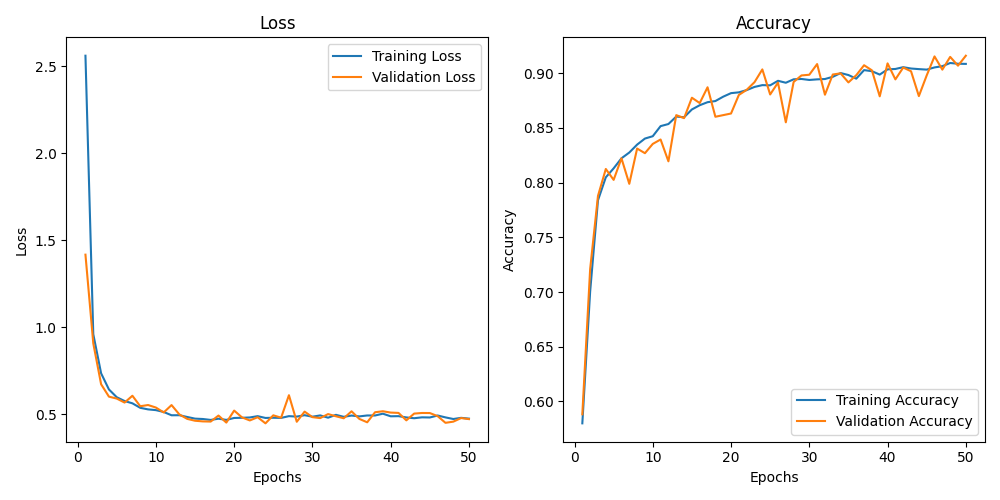

# 🩺 OSA Diagnosis Web Application using ECG Signals

Welcome to a transformative medical AI solution designed for **early detection and severity prediction** of **Obstructive Sleep Apnea (OSA)** using ECG signals. Built with a robust **1D Convolutional Neural Network (CNN)** and wrapped in a user-friendly **Django web application**, this project empowers **doctors** to diagnose OSA with speed, precision, and ease.

---

## 🚀 Features

- 👨‍⚕️ **Doctor Authentication**: Secure signup and login system.
- 📝 **Patient Management**: Store and retrieve patient records efficiently.
- ⚖️ **BMI Calculation**: Automatically computes **Body Mass Index** from patient height and weight.
- 📈 **Upload ECG CSV**: Doctors upload ECG data files sampled at **100 Hz**.
- 🧠 **AI-Powered Diagnosis**: A trained 1D CNN predicts:
  - Presence of OSA
  - **Severity**: Mild | Moderate | Severe
- 📊 **Health Insights**: Explore the relationship between OSA severity and factors like **BMI, height, and weight**.
- 🔁 **Revisit Support**: For returning patients, just upload a new ECG file — no need to re-enter patient details.
- 📹 **Demo Included**: See how it works in a short demo video.

---

## 🧠 Model Architecture

Our 1D CNN was designed and trained specifically for ECG signals with a sampling frequency of **100 Hz**.


| Layer (type)               | Output Shape       | Param #     |
|---------------------------|--------------------|-------------|
| Conv1D                    | (None, 5991, 64)   | 704         |
| BatchNormalization        | (None, 5991, 64)   | 256         |
| LeakyReLU                 | (None, 5991, 64)   | 0           |
| MaxPooling1D              | (None, 2995, 64)   | 0           |
| Dropout                   | (None, 2995, 64)   | 0           |
| Conv1D                    | (None, 2991, 128)  | 41,088      |
| LeakyReLU                 | (None, 2991, 128)  | 0           |
| MaxPooling1D              | (None, 1495, 128)  | 0           |
| Dropout                   | (None, 1495, 128)  | 0           |
| Conv1D                    | (None, 1493, 256)  | 98,560      |
| BatchNormalization        | (None, 1493, 256)  | 1,024       |
| LeakyReLU                 | (None, 1493, 256)  | 0           |
| MaxPooling1D              | (None, 746, 256)   | 0           |
| Dropout                   | (None, 746, 256)   | 0           |
| Conv1D                    | (None, 744, 512)   | 393,728     |
| LeakyReLU                 | (None, 744, 512)   | 0           |
| MaxPooling1D              | (None, 372, 512)   | 0           |
| Dropout                   | (None, 372, 512)   | 0           |
| Conv1D                    | (None, 370, 1024)  | 1,573,888   |
| BatchNormalization        | (None, 370, 1024)  | 4,096       |
| LeakyReLU                 | (None, 370, 1024)  | 0           |
| MaxPooling1D              | (None, 185, 1024)  | 0           |
| Dropout                   | (None, 185, 1024)  | 0           |
| Flatten                   | (None, 189440)     | 0           |
| Dense                     | (None, 512)        | 96,993,792  |
| Dropout                   | (None, 512)        | 0           |
| Dense                     | (None, 256)        | 131,328     |
| BatchNormalization        | (None, 256)        | 1,024       |
| Dropout                   | (None, 256)        | 0           |
| Dense                     | (None, 1)          | 257         |


---

## 📊 Training Performance

<p align="left">
  
</p>

> **Note**: The model was trained on labeled ECG datasets and validated for high precision and reliability in OSA classification.

---
## 📋 Classification Report

| Class | Precision | Recall | F1-Score | Support |
|-------|-----------|--------|----------|---------|
| 0     | 0.92      | 0.93   | 0.92     | 2801    |
| 1     | 0.89      | 0.88   | 0.88     | 1913    |
| **Accuracy** |       |        | **0.91** | **4714** |

---

## 💾 Demo

- 📽️ **Full Demo Video (Django Web App)**: [Watch on Google Drive](https://drive.google.com/file/d/1pQ66heM4wFee2g9uJoUKD5EKA6uIgEZ6/view?usp=drive_link)

---
## 🖥️ Run the Project Locally

Follow the steps below to set up and run the OSA Diagnosis Web Application on your local machine:

- **Clone the Repository:**
  ```
  git clone https://github.com/mastervikramk/Web_app_for_OSA_Diagnosis_using_Deep_Learning.git
  cd Web_app_for_OSA_Diagnosis_using_Deep_Learning
  ```
  - **Install python-3.10:**
  ```
  Invoke-WebRequest -Uri "https://www.python.org/ftp/python/3.10.11/python-3.10.11-amd64.exe" -OutFile "python-3.10.11-amd64.exe"
  .\python-3.10.11-amd64.exe /quiet InstallAllUsers=1 PrependPath=1 Include_test=0 
  ```

- **Create a Virtual Environment(Windows):**
  ```powershell
  py -3.10 -m venv new_venv
  .\new_venv\Scripts\Activate.ps1  
  ```

- **Install Dependencies:**
  ```
  pip install -r requirements.txt
  ```

- **Download the Trained Model:**
  - Download the model from this [Model](https://drive.google.com/file/d/1j1wLkALEAPzME3Mai_PAcUVM-fTtBhAZ/view?usp=drive_link)
  - Move the downloaded file (e.g., `model2.tflite`) into models folder

- **Run the Server:**
  ``
  python manage.py runserver
  ```

- **Access the App:**
  Visit [http://127.0.0.1:8000](http://127.0.0.1:8000)

---


